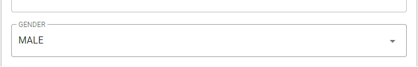
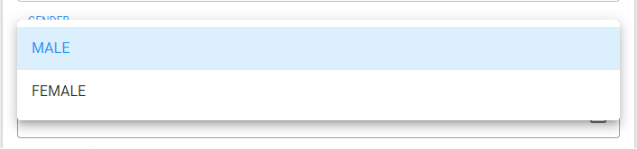

<div align="center">
  <h1>Enumeration</h1>

  <p>
    An useful concept of Enumeration in JavaScript!
  </p>
</div>

<br/>

<!-- About the Project -->
## :star2: About the Project
This project was created in order to provide an useful and helpful JavaSciprt Enumeration for developers.

You can use it for comparisons in code and also are able to generate an array that can be easily binded in a select component, for example.

<!-- Getting Started -->
##  :toolbox: Getting Started

<!-- Installation -->
### :gear: Installation

Install enumeration with npm

```bash
  npm install @jslibrary/enumeration
```

<!-- Usage -->
# :eyes: Usage


First of all, you have to create your enumerations. There are two suggested ways for doing it:

1 - Extending Enumeration class.

2 - Using a new instance of Enumeration.


## 1 - Extending Enumeration class ...


```javascript
import { Enumeration } from '@jslibrary/enumeration'

Class Gender extends Enumeration {
  constructor() {
    super()

    this.add('M', 'Male', 'MALE')
    this.add('F', 'Female', 'FEMALE')
  }
}

export default new Gender()
```

## 2 - Using a new Instance of Enumeration ...


```javascript
import { Enumeration } from '@jslibrary/enumeration'

const enumeration = new Enumeration()

enumeration.add('M', 'Male', 'MALE')
enumeration.add('F', 'Female', 'FEMALE')

export default enumeration
```

After this, you are ready to use your own enumeration in your code

## Using my own Enumeration ...

```javascript
import Gender from './Gender'

if (person.gender === Gender.Female) {
  ...
}

```

If you need a JSON to populate a select with this options, you can call .toJSON() method. The result is something like this:

```javascript
[
  {value: 'M', variable: 'Masculino', text: 'MASCULINO'},
  {value: 'F', variable: 'Feminino', text: 'FEMININO'}
]
```

Binding this JOSN on a select component the result is this:
```html
<v-select
  label="GENDER"
  v-model="person.gender"
  :items="Gender.toJSON()"
>
</v-select>
```



<br/>


